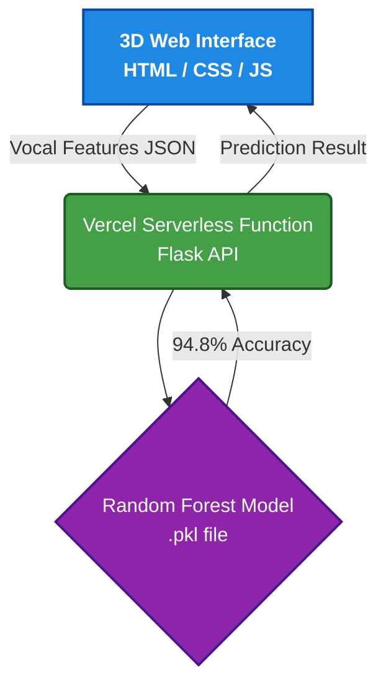

# Parkinson's Disease Prediction using Machine Learning and Explainable AI

This project focuses on the prediction of Parkinson's Disease using biomedical voice features. It implements supervised machine learning algorithms (Random Forest, SVM) alongside Explainable AI (XAI) tools such as SHAP and LIME to ensure transparency and interpretability in healthcare diagnostics.

The project features a **Premium 3D Web Interface** with a Serverless Python API, easily deployable via Vercel.

---

## 🏗️ System Architecture



---

## 🎯 Objective

Develop a robust machine learning pipeline capable of predicting Parkinson's Disease from voice recordings, while offering explainability for end-users and medical professionals, all accessible through a beautiful web dashboard.

---

## 📊 Results

The model achieved highly accurate predictive performance:
- **Accuracy:** `94.87%`
- **Precision:** `0.95`
- **Recall:** `0.95`
- **F1-Score:** `0.95`

SHAP visualizations highlighted key voice-based biomarkers, and LIME confirmed model stability on diverse patient samples.

---

## 🧰 Technologies & Tools

- **Frontend:** HTML5, CSS3 (Glassmorphism & 3D CSS), Vanilla JS
- **Backend API:** Python, Flask, Vercel Serverless
- **Machine Learning:** Scikit-learn, Pandas, NumPy
- **Explainable AI:** SHAP, LIME

---

## 🚀 Getting Started (Run Locally)

1. **Clone the repository:**
   ```bash
   git clone https://github.com/prateek0208/Parkinsons-Disease-Detection.git
   cd Parkinsons-Disease-Detection
   ```

2. **Run the API backend:**
   ```bash
   cd api
   pip install -r requirements.txt
   python index.py
   ```

3. **Open the 3D Frontend:**
   Double-click the `index.html` file in your browser.

---

## 🌐 Deploy to Vercel

1. Create a free account on [Vercel](https://vercel.com).
2. Click **Add New Project** and import this GitHub repository.
3. Vercel will automatically detect the `vercel.json` and the `api/` folder.
4. Click **Deploy**. Your 3D Web App and Python API will be live globally in under a minute!

---

## 👤 Author

**Prateek Ranjan**
- **GitHub:** [prateek0208](https://github.com/prateek0208)
