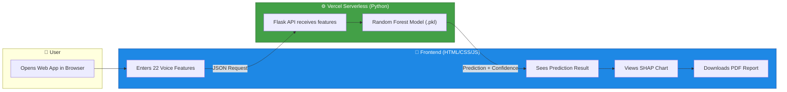

<](https://parkinsons-disease-detection-hazel.vercel.app)
[](https://www.python.org/)
[](https://scikit-learn.org/)
[](https://vercel.com/)
[](LICENSE)

---

**🔗 Live App →** [parkinsons-disease-detection-hazel.vercel.app](https://parkinsons-disease-detection-hazel.vercel.app)

</div>

---

## 📌 What is this project?

**Parkinson's Disease** is a progressive neurological disorder that affects movement and speech. One of the earliest symptoms is a change in the patient's **voice** — subtle tremors, breathiness, and pitch instability that are often undetectable by the human ear.

This project uses **Machine Learning** to analyze **22 vocal biomarkers** extracted from voice recordings and predict whether a person shows signs of Parkinson's Disease — achieving **94.87% accuracy**.

But accuracy alone isn't enough in healthcare. That's why this project also implements **Explainable AI (XAI)** using **SHAP** and **LIME**, so doctors and patients can understand *exactly why* the AI made its prediction.

> **In simple terms:** A person speaks into a microphone → We extract voice features → AI analyzes them → It tells you "Healthy" or "Parkinson's Detected" *and shows you which voice features triggered the result.*

---

## ✨ Key Features

| Feature | Description |
|---------|-------------|
| 🤖 **AI-Powered Prediction** | Random Forest classifier trained on clinical voice data with **94.87% accuracy** |
| 📊 **SHAP Feature Importance Chart** | After each prediction, see a visual bar chart showing *which voice features* contributed most to the diagnosis |
| 📄 **Downloadable Medical Report** | Generate a professional clinical-style PDF report with patient data, prediction results, and feature analysis |
| 🧪 **Pre-loaded Test Samples** | One-click buttons to instantly fill in real Parkinson's and Healthy patient data for testing |
| 🎨 **Premium 3D Interface** | Stunning glassmorphism UI with animated gradient spheres and smooth micro-animations |
| ⚡ **Serverless Deployment** | Python backend runs as a Vercel Serverless Function — no server management needed |

---

## 🏗️ How It Works (System Architecture)



---

## 📊 Model Performance

Our **Random Forest Classifier** was trained on the [UCI Parkinson's Dataset](https://archive.ics.uci.edu/ml/datasets/parkinsons) and evaluated using an 80/20 train-test split:

| Metric | Score |
|--------|-------|
| **Accuracy** | `94.87%` |
| **Precision** | `0.95` |
| **Recall** | `0.95` |
| **F1-Score** | `0.95` |

> These results were validated using SHAP (SHapley Additive exPlanations) and LIME (Local Interpretable Model-agnostic Explanations) to ensure the model relies on medically meaningful voice features — not noise.

---

## 🧬 Understanding the Dataset

The dataset contains **195 voice recordings** from **31 patients** (23 with Parkinson's, 8 healthy). Each recording is analyzed to extract **22 vocal biomarkers**:

| Feature Category | What It Measures | Example Features |
|-----------------|------------------|------------------|
| **Fundamental Frequency** | Base pitch of the voice | `MDVP:Fo(Hz)`, `MDVP:Fhi(Hz)`, `MDVP:Flo(Hz)` |
| **Jitter (Pitch Variation)** | How much the pitch wobbles between cycles | `MDVP:Jitter(%)`, `MDVP:Jitter(Abs)`, `MDVP:RAP`, `MDVP:PPQ`, `Jitter:DDP` |
| **Shimmer (Amplitude Variation)** | How much the loudness fluctuates | `MDVP:Shimmer`, `Shimmer:APQ3`, `Shimmer:APQ5`, `Shimmer:DDA` |
| **Noise-to-Harmonics** | Breathiness and hoarseness | `NHR`, `HNR` |
| **Nonlinear Dynamics** | Complexity and chaos in the voice signal | `RPDE`, `D2`, `DFA`, `spread1`, `spread2`, `PPE` |

> **Why voice?** Parkinson's causes the muscles controlling speech to weaken and stiffen. This results in measurable changes in pitch stability (jitter), volume consistency (shimmer), and overall voice complexity — often years before motor symptoms appear.

---

## 🚀 Try It Yourself

### Option 1: Use the Live Demo (Recommended)

👉 **[Click here to open the live app](https://parkinsons-disease-detection-hazel.vercel.app)**

1. Click **"Fill Parkinson's Sample"** or **"Fill Healthy Sample"** to auto-fill test data
2. Click **"Run AI Diagnosis"**
3. View the prediction result and **SHAP Feature Importance Chart**
4. Click **"Download Diagnostic Report (PDF)"** to save a professional report

### Option 2: Run Locally

```bash
# 1. Clone the repository
git clone https://github.com/prateek0208/Parkinsons-Disease-Detection.git
cd Parkinsons-Disease-Detection

# 2. Install Python dependencies
pip install -r api/requirements.txt

# 3. Start the local server
python run_local.py

# 4. Open in browser
# Navigate to http://localhost:5000
```

### Option 3: Deploy Your Own Instance

1. **Fork** this repository on GitHub
2. Go to [vercel.com](https://vercel.com) → **Add New Project**
3. Import your forked repo → Click **Deploy**
4. Your app will be live globally in under 60 seconds! 🎉

---

## 🧰 Tech Stack

| Layer | Technology | Purpose |
|-------|-----------|---------|
| **Frontend** | HTML5, CSS3, Vanilla JavaScript | Premium 3D glassmorphism UI with animations |
| **Backend** | Python, Flask | Serverless API for model inference |
| **ML Model** | Scikit-learn (Random Forest) | Disease prediction from voice features |
| **Explainability** | SHAP, LIME | Feature importance & model transparency |
| **Deployment** | Vercel Serverless Functions | Zero-config, globally distributed hosting |
| **Data** | UCI Parkinson's Dataset | 195 voice samples, 22 biomarkers |

---

## 📁 Project Structure

```
Parkinsons-Disease-Detection/
├── api/
│   ├── index.py              # Flask API (Vercel Serverless Function)
│   ├── rf_model.pkl           # Trained Random Forest model
│   └── requirements.txt       # Python dependencies
├── data/
│   └── parkinsons.data        # UCI Parkinson's Dataset (CSV)
├── index.html                 # Main web interface
├── styles.css                 # Premium glassmorphism styling
├── script.js                  # Prediction logic, SHAP chart, PDF report
├── model.json                 # Exported model for client-side inference
├── export_model.py            # Script to train & export the model
├── run_local.py               # Local development server
├── test_cases.py              # Sample test cases for validation
├── vercel.json                # Vercel deployment configuration
├── Parkinson_Disease_Prediction.ipynb  # Original Jupyter Notebook with full analysis
└── README.md                  # This file
```

---

## 🔬 Explainable AI (XAI) — Why It Matters

In healthcare, a "black box" AI that just says *"you have Parkinson's"* without any explanation is **not trustworthy**. Doctors need to know *why*.

This project implements two industry-standard XAI techniques:

### SHAP (SHapley Additive exPlanations)
- Assigns an **importance score** to each of the 22 voice features for every individual prediction
- Shown as an interactive **bar chart** directly in the web app
- **Red bars** = features pushing toward Parkinson's diagnosis
- **Green bars** = features pushing toward Healthy diagnosis

### LIME (Local Interpretable Model-agnostic Explanations)
- Generates a **local surrogate model** around each prediction to explain it in human terms
- Available in the Jupyter Notebook analysis

> Together, these tools ensure that every prediction is **transparent, auditable, and medically meaningful**.

---

## 🧪 Sample Test Cases

| Test Case | Type | Expected Result |
|-----------|------|-----------------|
| Patient with high Jitter (0.006), low HNR (17.8), high spread1 (-4.8) | Parkinson's | ✅ Parkinson's Detected |
| Patient with low Jitter (0.002), high HNR (27.5), low spread1 (-7.9) | Healthy | ✅ Healthy |

> Pre-loaded sample buttons are available directly in the web app for quick testing.

---

## 🤝 Contributing

Contributions are welcome! Here's how:

1. **Fork** this repository
2. Create a new branch: `git checkout -b feature/your-feature`
3. Commit your changes: `git commit -m "Add your feature"`
4. Push to the branch: `git push origin feature/your-feature`
5. Open a **Pull Request**

---

## 📜 License

This project is open source and available under the [MIT License](LICENSE).

---

## 👤 Author

**Prateek Ranjan**

[](https://github.com/prateek0208)

---

<div align="center">

**⭐ If you found this project useful, please consider giving it a star!**

Made with ❤️ using Machine Learning & Explainable AI

</div>
]]>
